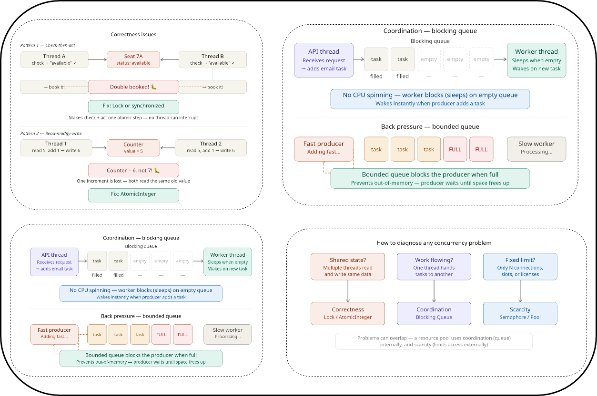

# Concurrency in Python: Correctness, Coordination, Scarcity



This folder gives practical, runnable examples of the three most common concurrency design problems.

## What You Will Learn

- Correctness: how race conditions corrupt shared state.
- Coordination: how threads safely hand work to each other.
- Scarcity: how to protect a limited resource from overload.

## Quick Start

From this folder, run:

```bash
python3 correctness.py
python3 coordination.py
python3 scarcity.py
```

## Concept Map

| Problem Type | Main Question | Primary Tool | Example Script |
| --- | --- | --- | --- |
| Correctness | "Can two threads update the same state safely?" | `threading.Lock` | `correctness.py` |
| Coordination | "How do workers wait for and receive work?" | `queue.Queue` (bounded, blocking) | `coordination.py` |
| Scarcity | "How do we enforce a hard concurrency limit?" | `threading.Semaphore` | `scarcity.py` |

## 1) Correctness

Correctness issues happen when multiple threads read and write shared state without synchronization.

Common bug patterns:

- Check-Then-Act: one thread checks a condition, but another thread changes state before the action happens.
- Read-Modify-Write: two threads read the same value and both write an updated value, causing lost updates.

How this repo demonstrates it:

- `correctness.py` runs unsafe counter updates and booking logic first.
- Then it repeats the same logic with a lock.

Expected result:

- Unsafe output often shows wrong totals or inconsistent booking outcomes.
- Safe output matches expected totals and one consistent seat owner.

## 2) Coordination

Coordination is about passing work between threads without busy waiting.

Key idea:

- Use a blocking queue so workers sleep when there is no work and wake when tasks arrive.

How this repo demonstrates it:

- `coordination.py` starts producers and workers.
- A bounded queue applies back pressure when producers are faster than workers.
- Sentinel values stop workers cleanly after all tasks finish.

Expected result:

- Producers enqueue tasks.
- Workers process tasks in parallel.
- Program exits cleanly after all tasks complete.

## 3) Scarcity

Scarcity means a resource has a strict limit, such as database connections or external API capacity.

Key idea:

- Use a semaphore as a permit bucket.
- A thread must acquire a permit before using the resource.

How this repo demonstrates it:

- `scarcity.py` limits concurrent API calls with `threading.Semaphore`.
- It tracks active calls and peak concurrency.
- `try/finally` guarantees permit release, even on failures.

Expected result:

- Peak active calls should never exceed the configured limit.

## Decision Checklist

When debugging a concurrency issue, ask:

- Is state shared and mutable across threads? Choose correctness tools (locks/atomics).
- Is work being transferred between threads? Choose coordination tools (blocking queues).
- Is there a hard cap on resources? Choose scarcity tools (semaphores/resource pools).

## Practical Rules of Thumb

- Keep critical sections small and focused.
- Prefer message passing (queues) over shared mutable state when possible.
- Always release permits/resources in `finally` blocks.
- Add load tests for timing-sensitive code paths.