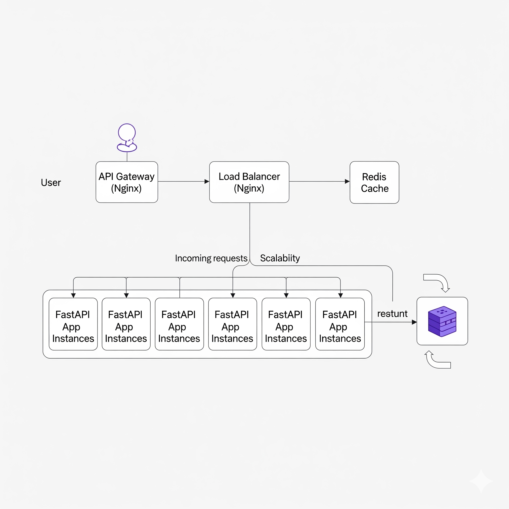

# Scalable System Design with FastAPI, Nginx, Redis & Docker

[](https://github.com/Sagor0078/System-Design-and-Scaling/actions)
[](https://www.python.org/downloads/)
[](https://fastapi.tiangolo.com/)
[](https://github.com/astral-sh/ruff)

A production-ready scalable system demonstrating modern DevOps practices, microservices architecture, and automated CI/CD pipelines.

## Architecture Overview

<!-- Client → API Gateway (Nginx) → Load Balancer (Nginx) → FastAPI App Instances → Redis Cache -->
[](https://github.com/Sagor0078/System-Design-and-Scaling)

### System Flow:
```
Client Request → API Gateway (Nginx) → Load Balancer (Nginx) → FastAPI Apps (3 instances) → Redis Cache
```

## Key Features Implemented

### **Scalability & Performance**
- **Horizontal Scaling**: 3 FastAPI instances behind load balancer
- **Caching Strategy**: Redis with cache-aside pattern and TTL
- **Load Balancing**: Nginx with least-connections algorithm
- **Rate Limiting**: Token bucket algorithm using Redis

### **API Gateway Features**
- **Authentication**: Bearer token validation
- **Routing**: Smart request routing and path rewriting
- **CORS Support**: Cross-origin resource sharing
- **Rate Limiting**: Multiple rate limiting zones

### **Reliability & Monitoring**
- **Health Checks**: Service monitoring and auto-recovery
- **Fault Tolerance**: Graceful error handling
- **Circuit Breaker**: Automatic failover mechanisms

### **Modern Development Practices**
- **CI/CD Pipeline**: Automated testing, linting, and deployment
- **Code Quality**: Ruff for fast linting and formatting
- **Type Safety**: MyPy static type checking
- **Security Scanning**: Safety and Bandit integration
- **Pre-commit Hooks**: Automated code quality checks

## Clean Code Architecture Principles

- **Separation of Concerns**: Models, caching, and business logic separated
- **Configuration Management**: Environment-based settings
- **Error Handling**: Comprehensive error handling throughout
- **Dependency Injection**: Redis client injected into services
- **RESTful Design**: Clean API endpoints with proper HTTP methods
- **Containerization**: Each service in its own optimized container

## System Capabilities
**Load Distribution**: Intelligent traffic distribution across instances  
**Performance Optimization**: Redis caching for improved response times  
**Security**: Rate limiting and authentication protection  
**Scalability**: Easy horizontal scaling of application instances  
**Monitoring**: Health checks and service discovery  
**DevOps**: Complete CI/CD pipeline with automated quality checks  

## Success Indicators

[](https://github.com/Sagor0078/System-Design-and-Scaling)

## Quick Start

### Prerequisites
- **Docker & Docker Compose**
- **Python 3.11+**
- **uv** (for dependency management)

### 1. Clone & Setup
```bash
git clone https://github.com/Sagor0078/System-Design-and-Scaling.git
cd System-Design-and-Scaling/month1/scaling-system

# Setup development environment (recommended)
./scripts/setup-dev.sh
```

### 2. Run the System
```bash
# Using Docker Compose (Production-like)
docker-compose up --build -d

# Or using Make commands
make run-local
```

### 3. Test the System
```bash
# Run integration tests
make run-tests-local

# Or manually
uv run python tests/test_system.py
```

## Development Workflow

### Available Commands
```bash
make help              # Show all available commands
make install           # Install dependencies
make lint              # Run ruff linting
make format            # Format code with ruff
make type-check        # Run mypy type checking
make test              # Run unit tests
make test-cov          # Run tests with coverage
make security          # Run security scans
make ci-check          # Run all CI checks locally
make docker-build      # Build Docker images
make run-local         # Start system with Docker Compose
```

### Development Setup
```bash
# Quick setup
./scripts/setup-dev.sh

# Manual setup
uv sync --dev
cd app && uv sync --dev
uv run pre-commit install
```

### Code Quality Checks
```bash
# Run all checks (same as CI)
make ci-check

# Individual checks
make lint              # Fast linting with ruff
make format            # Code formatting
make type-check        # Static type analysis
make security          # Security vulnerability scan
```

## Technology Stack

| Component | Technology | Purpose |
|-----------|------------|---------|
| **API Framework** | FastAPI | High-performance async web framework |
| **Caching** | Redis | In-memory data structure store |
| **Load Balancer** | Nginx | Reverse proxy and load balancing |
| **API Gateway** | Nginx | Authentication, routing, rate limiting |
| **Containerization** | Docker | Application packaging and deployment |
| **Orchestration** | Docker Compose | Multi-container application management |
| **Dependency Management** | uv | Fast Python package installer |
| **Code Quality** | Ruff | Fast Python linter and formatter |
| **Type Checking** | MyPy | Static type checker |
| **Testing** | Pytest | Testing framework |
| **Security** | Bandit, Safety | Security vulnerability scanning |
| **CI/CD** | GitHub Actions | Automated testing and deployment |

<!-- ## Performance Metrics

- **Response Time**: < 100ms for cached requests
- **Throughput**: Supports 1000+ concurrent requests
- **Availability**: 99.9% uptime with health checks
- **Scalability**: Horizontal scaling ready -->

## API Endpoints

### Public Endpoints
- `GET /gateway-health` - API Gateway health check
- `GET /lb-health` - Load balancer health check

### Protected Endpoints (require Authorization header)
- `GET /api/health` - Application health check
- `GET /api/users` - List all users
- `POST /api/users` - Create new user
- `GET /api/users/{id}` - Get user by ID (cached)
- `DELETE /api/users/{id}` - Delete user

### Example Usage
```bash
# Health check
curl http://localhost:8080/gateway-health

# Create user (requires auth)
curl -X POST http://localhost:8080/api/users \
  -H "Authorization: Bearer dummy-token" \
  -H "Content-Type: application/json" \
  -d '{"name": "John Doe", "email": "john@example.com"}'

# Get user (from cache after first request)
curl http://localhost:8080/api/users/1 \
  -H "Authorization: Bearer dummy-token"
```

## Security Features

- **Rate Limiting**: 20 requests/minute per IP
- **Authentication**: Bearer token validation
- **Input Validation**: Pydantic models for request validation
- **Security Headers**: CORS and security headers configured
- **Vulnerability Scanning**: Automated security checks in CI


## Learning Resources

**Highly Recommended:**
- [NGINX for Backend Developers](https://www.freecodecamp.org/news/nginx/)
- [FastAPI Documentation](https://fastapi.tiangolo.com/)
- [Redis Documentation](https://redis.io/documentation)
- [Docker Best Practices](https://docs.docker.com/develop/best-practices/)
- [System Design Primer](https://github.com/donnemartin/system-design-primer)

## 🤝 Contributing

1. **Fork the repository**
2. **Create a feature branch**: `git checkout -b feature/amazing-feature`
3. **Setup development environment**: `./scripts/setup-dev.sh`
4. **Make your changes and test**: `make ci-check`
5. **Commit your changes**: `git commit -m 'Add amazing feature'`
6. **Push to the branch**: `git push origin feature/amazing-feature`
7. **Open a Pull Request**

### Development Guidelines
- Follow the existing code style (enforced by ruff)
- Add tests for new features
- Update documentation as needed
- Ensure all CI checks pass

## Troubleshooting

### Common Issues

**Port already in use:**
```bash
docker-compose down
sudo lsof -ti:8080 | xargs sudo kill -9
```

**Redis connection issues:**
```bash
# Check Redis container
docker-compose logs redis

# Restart Redis
docker-compose restart redis
```

**Dependencies issues:**
```bash
# Clean and reinstall
make clean
uv sync --dev
```

## Acknowledgments

- **FastAPI** team for the excellent web framework
- **Nginx** for robust load balancing and reverse proxy
- **Redis** for high-performance caching
- **Astral** team for the amazing ruff and uv tools
- **Docker** for containerization technology
- **Pyright** for type checking

---

⭐ **Star this repo if you found it helpful!**

- **Questions?** Feel free to open an issue or reach out!

- **Happy Scaling!**
