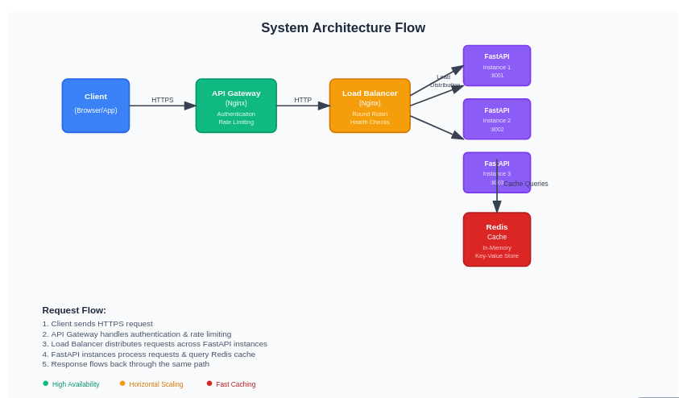
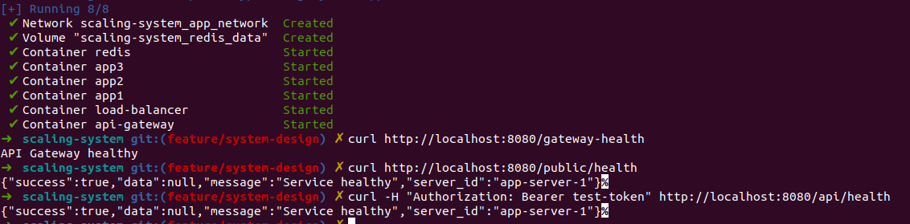

## Architecture Overview

<!-- Client → API Gateway (Nginx) → Load Balancer (Nginx) → FastAPI App Instances → Redis Cache -->

## Key Features Implemented:

- Scaling: 3 FastAPI instances (horizontal scaling)
- Caching: Redis with cache-aside pattern and TTL
- Load Balancing: Nginx with least-connections algorithm
- API Gateway: Authentication, routing, CORS, rate limiting
- Rate Limiting: Token bucket algorithm using Redis
- Health Checks: Service monitoring and auto-recovery

## Clean Code Architecture Principles:

- Separation of Concerns: Models, caching, and business logic are separated
- Configuration: Environment-based settings
- Error Handling: Graceful error handling throughout
- Dependency Injection: Redis client injected into services
- RESTful Design: Clean API endpoints with proper HTTP methods
- Containerization: Each service in its own container

Quick Start:

- Clone the structure and create all files as shown
- Run the system: docker-compose up --build -d
- Test it: python test_system.py

## The system demonstrates:

- Load distribution across multiple app instances
- Caching performance improvements
- Rate limiting protection
- API gateway features (auth, routing, throttling)
- Fault tolerance with health checks

## Success Indicators

